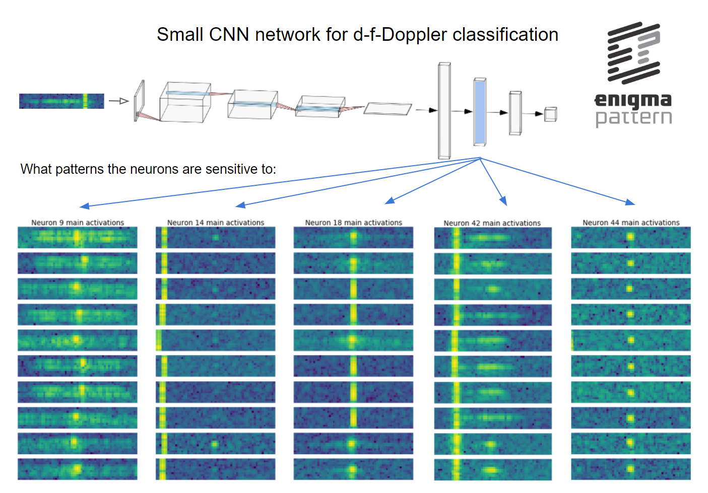

# MachineLearning for Radars – episode 3

Can you look inside a neural network trained on a radar data?

We trained a small **convolutional neural network** on a bunch of Doppler spectra (namely **distance** to **frequency** planes), to classify targets. The network achieved a very good score (over 95% Accuracy on a balanced test dataset).

But the real question is: can we trust it?

One way to show that the networks behaves rationally is to look at individual neurons, and to check what, during the training processes, they have specialized in. Do they pick information that makes sense? Or are they sensitive to some random data?

As you can see on the attached image, the network learned some useful skills. The neurons are triggered by specific and practical patterns, and their reasonable responses will be used later to form the ultimate network’s decision.

At Enigma Pattern, we work with **Radars**, and enrich their algorithms with **deep neural networks**.