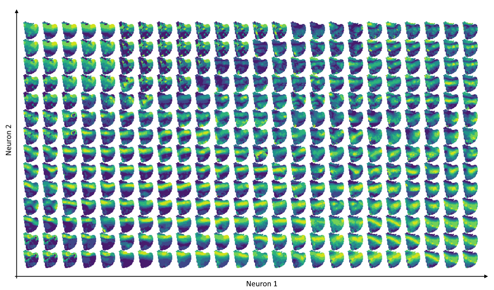

# MachineLearning for Radars – episode 4

How do neural networks organize the radar data?

We took a couple of hundreds of **weather radar** surface currents maps from the North Western Mediterranean coast.

We built an **autoencoder** – a network that has a bottleneck (in our case, a layer of just 2 neurons), where the information gets squeezed. Like in a .zip file – we started with the whole map (1428 pixels in our case), and we forced the network to shrink it to just 2 numbers.

Using these two numbers, we plotted the maps on a bigger plane.

As you can see, the network did a really good job. Similar maps are grouped together. It means the network figured out what is common (but specific) about them, and used this knowledge to reduce the information size (from 1428 numbers, to just 2).

At Enigma Pattern, we work with **Radars**, and enrich their algorithms with **deep neural networks**.
