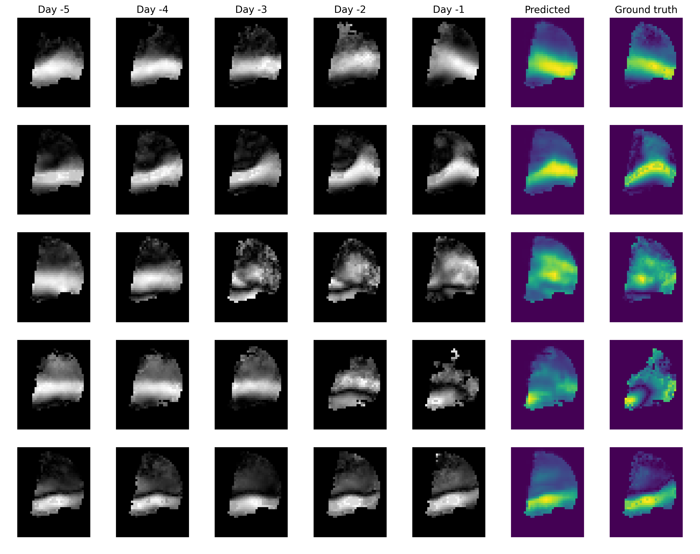

# MachineLearning for Radars – episode 5

Can **neural networks**, charged with **radar data**, predict future?

Of course they can!

We trained a special type of neural network, called **u-net**, to predict the currents of the North Western Mediterranean. The model had only the knowledge of the 5 past days, and its goal was to predict the currents for the next day.

On the attached image you can see the results in a form of currents maps:
  * the gray images represent the past days
  * the blue images represent the prediction of the model (left) and the real weather on that day (right)
  * colors indicates the speed of the currents (white / yellow shows quick currents, black / blue shows slow currents).

As you can see, the predictions were very close to reality. It’s astonishing how well neural networks can model such complex physical phenomena as weather.

At Enigma Pattern, we work with **Radars**, and enrich their algorithms with **deep neural networks**.
