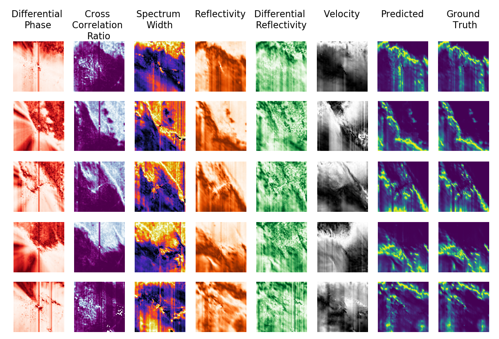

# MachineLearning for Radars – episode 6

Can **neural networks** combine many different types of **radar data**?

Modern radars tend to measure a lot of different types of signal. We trained a simple **u-net** network to mark **precipitations** based on a few features for a weather radar:
  * **Differential phase**
  * **CC ratio**
  * **Spectrum width**
  * **Reflectivity**
  * **Differential reflectivity**
  * **Velocity**

As you can see from the attached image, the network did a really good job. If you inspect the predicted rainfalls and the ground truth, you will even see that the predicted images are better quality (less vertical artifacts) than the collected ground truth!

At Enigma Pattern, we work with **Radars**, and enrich their algorithms with **deep neural networks**.
