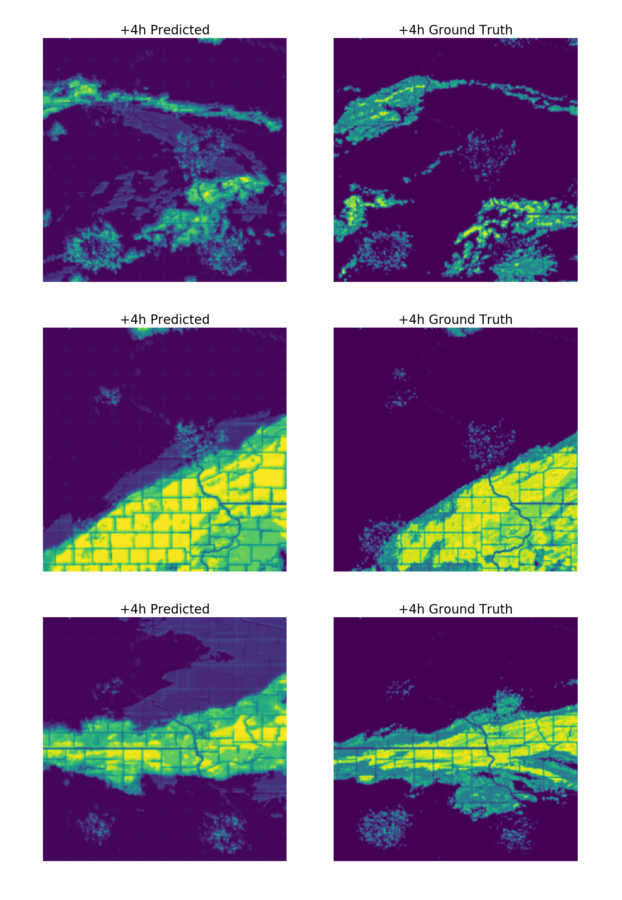

# MachineLearning for Radars – episode 7

Can **neural networks** surpass the most sophisticated weather prediction models?

Well, it depends how you define "surpass". These complex weather prediction models are really good, but their drawback is their **computation time**. It takes hours (and sometimes days) to calculate the prediction – which means it’s **not feasible** to make them predicting **the close future** (up to 6 hours). This close future prediction is called **nowcasting**, and it’s actually pretty vital when you decide if you want to take an umbrella with you to work.

And in nowcasting our networks shine – they might be slightly less precise, but they can look into the close future in the matter of seconds.

Here’s an example of nowcasting done by our network, trained to predict +4hrs weather. Look how precise the predictions are. And it took less than 10 seconds to calculate each map!

At Enigma Pattern, we work with **Radars**, and enrich their algorithms with **deep neural networks**.
