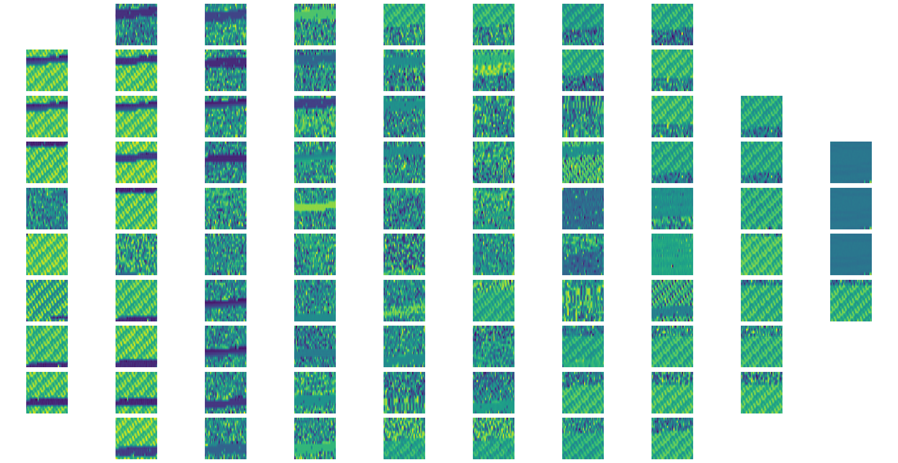

# MachineLearning for Radars – episode 8

How does a **radar** see **WiFi** or **LTE**?

Can you use a radar to check if your neighbor is talking over the mobile? Or if they are just watching Netflix?

Scary as it sounds, actually you can. 

One of the way to do it is to passively listen to what is happening in the radio frequencies, and convert these waves into a 2d representation of **amplitude+phase shift matrices**. For obvious reasons we will not show you how to classify them – but if you want to see how they look like, and what’s the relation between them in a **latent space**, look at the attached image. On some of these matrices lies the knowledge of what your neighbors are doing...

At Enigma Pattern, we work with **Radars**, and enrich their algorithms with **deep neural networks**.
