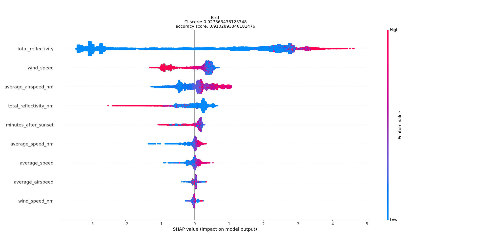

# MachineLearning for Radars – episode 9

Can we understand how **Artificial Intelligence** uses **radar data**?

This is a very common situation: we build a model, but we want to understand how it formulates its decision. And, above all, if we can trust it.

Here we show an example of such explanation. We trained a simple model to spot birds, and we run a Shapley method to visualize the model’s decision process:
  * The highest impact on the model’s decision has **total reflectivity**. Although small values were both present for birds and non-birds (long blue line), high values of **total reflectivity** (red line) are very specific for birds. 
  * Also, **wind speed** is also a good indicator. When its value is high (red), the model’s sure birds don’t fly. When wind speed is small (blue), the model looses its confidence (blue and red mesh).
  * And so on – you can have as many factors explained as you wish...

At Enigma Pattern, we work with **Radars**, and enrich their algorithms with **deep neural networks**.
