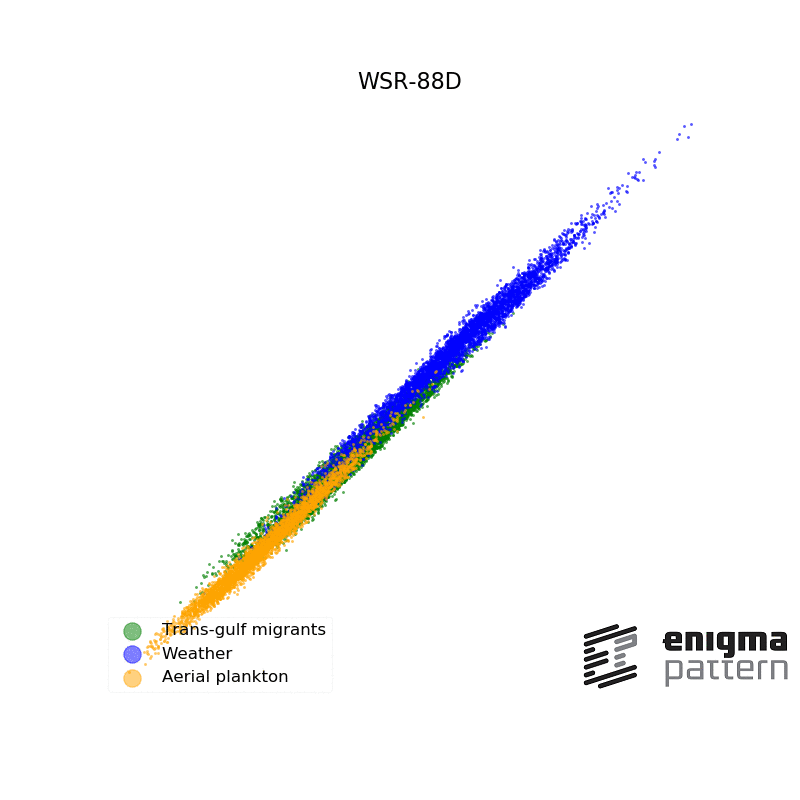

# MachineLearning for Radars – episode 1

Can a weather radar spot plankton? Can it tell birds from rain?

Well, obviously, it can. But only if it pays attention to a LOT of details. 

Here we present a latent 2d space calculated from:
• **radial velocity**,
• **reflectivity**,
• **spectrum width**,
• **differential reflectivity**, 
• and **correlation coefficient**. 

See how the different object stick to themselves, and it’s really hard to tell what is what? What is plankton, and what is rain?

But add just one bit of information, namely **differential phase**, to the picture… and everything changes. Suddenly the information set is rich enough so the objects group themselves nicely. This was the missing puzzle!

[]

At Enigma Pattern, we work with **Radars**, and enrich their algorithms with **deep neural networks**.