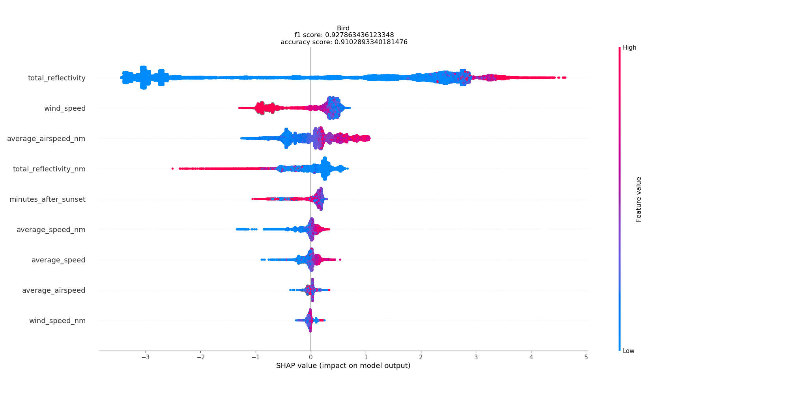
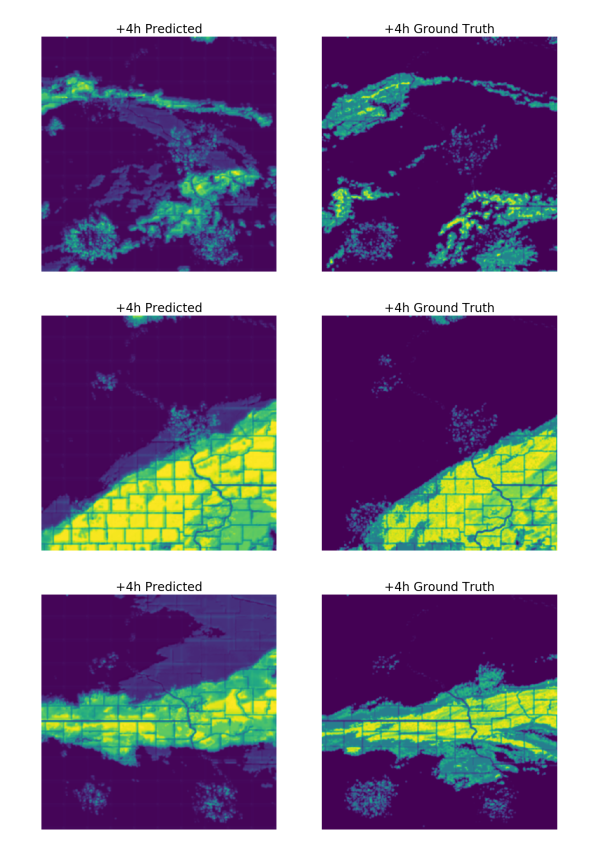
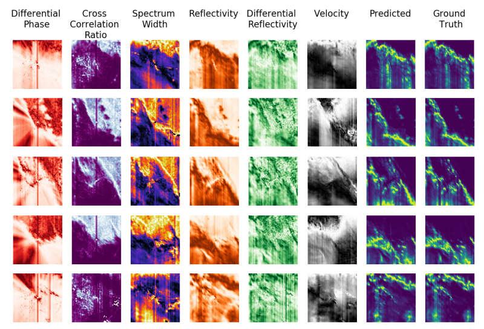
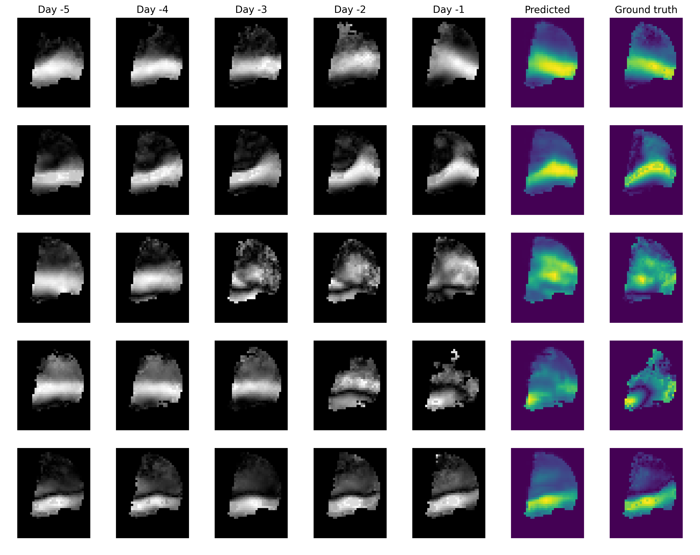
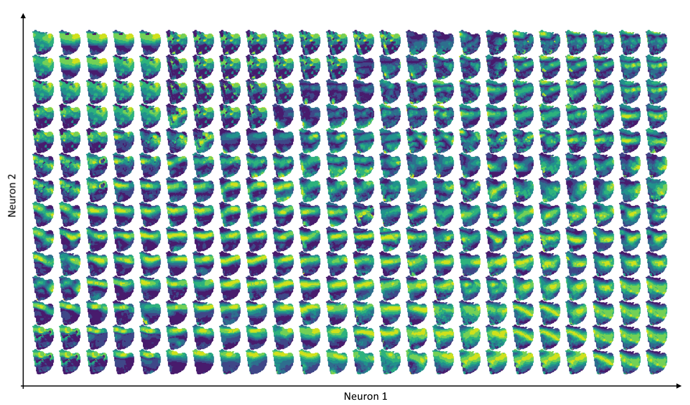
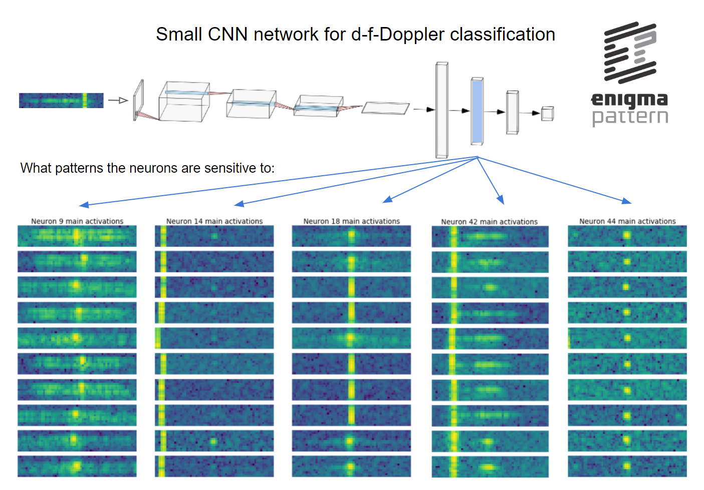
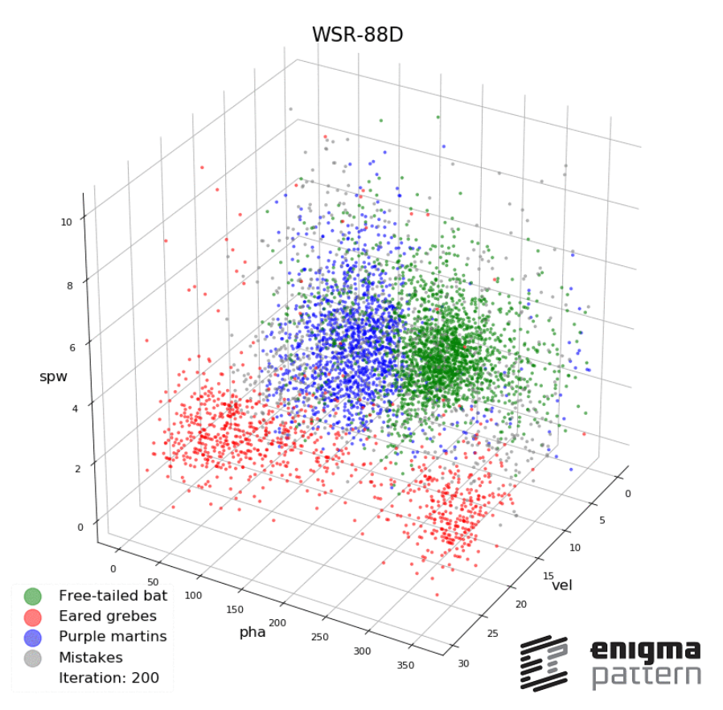
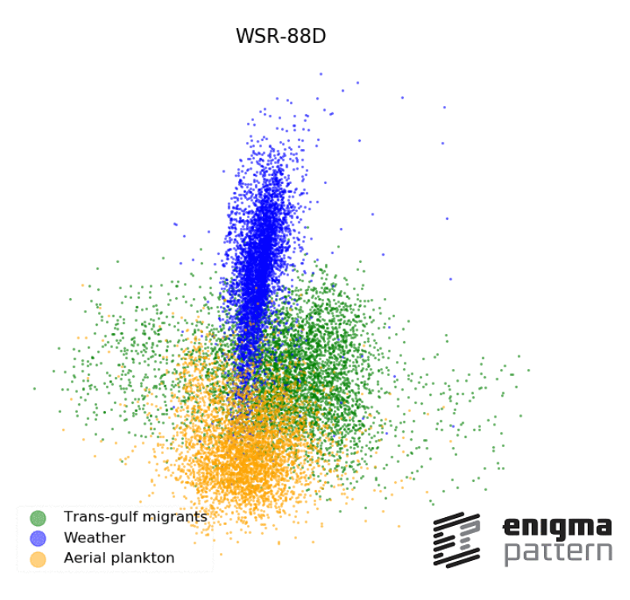

# Machine Learning for Radars

Welcome to our showcase page. We hope it will trigger your interest in our work. 

If you would like to have a chat with us, please just drop us an email at <hello@enigmapattern.com>.

Yours, 
Enigma Pattern team

***

#### [9. Can we understand how Artificial Intelligence uses radar data?](Artefacts/Episode_9/) 

***

#### [8. How does a radar see WiFi or LTE?](Artefacts/Episode_8/) 

***

#### [7. Can neural networks surpass the most sophisticated weather prediction models?](Artefacts/Episode_7/) 

***

#### [6. Can neural networks combine many different types of radar data?](Artefacts/Episode_6/) 

***

#### [5. Can neural networks, charged with radar data, predict future?](Artefacts/Episode_5/) 

***

#### [4. How do neural networks organize the radar data?](Artefacts/Episode_4/) 

***

#### [3. Can you look inside a neural network trained on a radar data?](Artefacts/Episode_3/) 

***

#### [2. How an algorithm learns the radar data?](Artefacts/Episode_2/) 

***

#### [1. Can a weather radar spot plankton?](Artefacts/Episode_1/) 

